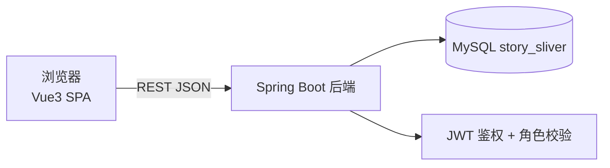
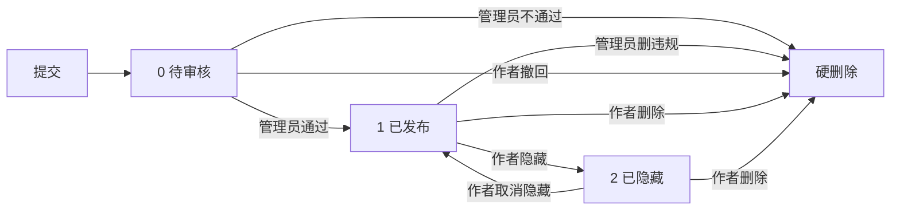

# 匿名故事碎片墙 · 开发计划

> 状态：设计已确认（v1.0）｜ 日期：2026-08-06 ｜ 参与方式：边做边讨论，随时可改
>
> 代码位置：后端 `fragment-story/`（骨架已完成）｜ 前端 `fragment‑story‑frontend/`（待初始化）

## 1. 项目概述

**一句话**：一个匿名的「故事碎片墙」——注册用户发布小段故事或生活碎片（可匿名），其他人点赞，发布需管理员审核，管理员负责维护秩序。

**上线目标**：不买域名、不备案，部署在腾讯云学生机上，通过 `http://IP:8080` 让任何人都能注册、登录、发布、点赞、管理，达到「真实上线」的效果。

**暂不包含（非目标）**：

- 评论、私信、找回密码、邮箱验证（字段预留，不实现）
- 图片 / 视频 / 富文本
- 举报与自动审核（后续可讨论）

## 2. 需求梳理

### 用户侧

| 编号 | 需求 | 说明 |
| --- | --- | --- |
| F1 | 注册 / 登录 | 用户名 + 昵称 + 密码；注册需算术验证码 |
| F2 | 发布碎片 | 1000 字封顶；可勾选「匿名发布」；5 分钟限发 1 条 |
| F3 | 审核后展示 | 发布后进入待审核，管理员通过后才出现在墙上 |
| F4 | 浏览碎片 | 只展示已发布；匿名显示「匿名用户」，非匿名显示昵称 |
| F5 | 点赞 / 取消点赞 | 登录后每人每条一次，可取消 |
| F6 | 我的碎片 | 查看自己全部碎片（待审核 / 已发布 / 已隐藏，含匿名） |
| F7 | 隐藏 / 取消隐藏 | 已发布的碎片可暂时隐藏（他人不可见），可随时恢复 |
| F8 | 删除自己的碎片 | 硬删除，弹窗确认「删除后无法撤回」 |
| F9 | 上传头像 | jpg/png、≤2MB；上传后进入待审核，管理员通过才展示；拒绝保留旧头像 |

### 管理侧

| 编号 | 需求 | 说明 |
| --- | --- | --- |
| A1 | 审核队列 | 管理员看到待审核碎片及真实发布者信息，通过或不通过 |
| A2 | 删除违规碎片 | 已发布 / 待审核均可硬删除，弹窗确认 |
| A3 | 用户管理（仅站长） | 指定 / 撤销管理员 |
| A4 | 系统配置（仅站长） | 修改「管理员注册特殊密码」 |
| A5 | 封禁 / 解封账号 | 管理员审核时发现违规可「删除并封禁」；封禁后无法登录（提示联系站长）；仅站长可解封 |

### 非功能要求

- 防恶意注册：算术验证码 + IP 限流（同一 IP 1 小时最多 5 个、24 小时最多 10 个）+ 用户名唯一 + 密码最少 6 位
- 统一响应体、全局异常处理、权限校验
- 代码分层清晰，方便后续加评论等功能

## 3. 技术选型

| 层 | 技术 | 状态 |
| --- | --- | --- |
| 后端 | Java 17 + Spring Boot 3.3.5 + MyBatis + MySQL 8 | ✅ 骨架已完成 |
| 认证 | JWT（无状态，30 天有效） | 待实现 |
| 密码 | BCrypt 加密 | 待实现 |
| 前端 | Vue3 + Vite + JavaScript + Vue Router + Axios | 待初始化 |
| 样式 | 手写 CSS（温暖文字流） | 待实现 |
| 部署 | 腾讯云轻量应用服务器（学生机） | 上线前 |

## 4. 总体架构

- 前后端分离：前端是纯静态 SPA，后端只出 JSON
- **单端口部署**：Spring Boot 托管前端打包后的静态文件，访问 `http://IP:8080` 直接打开页面，接口走 `/api`，上线后无需跨域
- 开发阶段前后端分开跑，Vite 代理 `/api` 到 `localhost:8080`，后端 CORS 已配置
- 后端模块划分：`user`（注册/登录/角色）→ `fragment`（发布/审核/点赞/隐藏）→ `admin`（审核/用户管理/系统配置）

## 5. 数据模型

### user（用户表，新增）

| 字段 | 说明 |
| --- | --- |
| id | 主键 |
| username | 唯一，登录用 |
| nickname | 对外展示 |
| password | BCrypt 哈希 |
| email | 可空，预留（不验证） |
| role | 0 普通用户 / 1 管理员 / 2 站长 |
| status | 0 正常 / 1 封禁（预留） |
| created_at / updated_at | 时间 |

### story_fragment（改现有表）

| 字段 | 说明 |
| --- | --- |
| id | 主键 |
| user_id | 真实发布者（外键 user.id，管理员可追溯） |
| content | 内容，1000 字封顶 |
| like_count | 点赞数（冗余计数） |
| is_anonymous | 0 显示昵称 / 1 显示「匿名用户」 |
| status | 0 待审核 / 1 已发布 / 2 已隐藏 |
| created_at / updated_at | 时间 |

硬删除直接删行（不留状态），并在同一事务里清理该碎片的所有点赞记录。

### fragment_like（点赞表，新增）

- `fragment_id` + `user_id` + `created_at`
- 唯一约束 `(fragment_id, user_id)`：每人每条只能赞一次；取消点赞 = 删记录，like_count 同步增减

### system_config（系统配置表，新增）

- `config_key` / `config_value` / `updated_at`
- 当前一项：`admin_register_code`（管理员注册特殊密码，存 BCrypt 哈希，站长可在管理页修改）

## 6. 碎片生命周期

规则：

- 提交后进入**待审核**，只有作者本人和管理员可见，不会出现在墙上
- 管理员**通过** → 已发布；**不通过** → 硬删除
- 已发布的碎片作者可**隐藏**（他人不可见）或**取消隐藏**
- 作者可删除自己的碎片（任意状态）；管理员可删除任意碎片——均为**硬删除**，前端弹窗确认「删除后无法撤回」
- 硬删除 = 从数据库真正删除，不可恢复

## 7. API 设计

### 认证与用户

| 方法 | 路径 | 说明 | 权限 |
| --- | --- | --- | --- |
| GET | `/api/auth/captcha` | 获取算术验证码（会话绑定、一次性） | 公开 |
| POST | `/api/auth/register` | 注册（用户名+昵称+密码+验证码；勾选管理员时另填特殊密码），成功自动登录 | 公开 |
| POST | `/api/auth/login` | 登录（用户名+密码）→ JWT | 公开 |
| GET | `/api/users/me` | 当前用户信息（昵称、角色等） | 登录 |

### 碎片

| 方法 | 路径 | 说明 | 权限 |
| --- | --- | --- | --- |
| POST | `/api/fragments` | 发布（content + isAnonymous），进入待审核；限频 5 分钟/条 | 登录 |
| GET | `/api/fragments` | 分页列表（仅已发布，新→旧） | 公开 |
| GET | `/api/fragments/my` | 我的碎片（全部状态，含匿名） | 登录 |
| POST | `/api/fragments/{id}/like` | 点赞，每人每条一次 | 登录 |
| DELETE | `/api/fragments/{id}/like` | 取消点赞 | 登录 |
| PUT | `/api/fragments/{id}/hide` | 隐藏（仅作者，限已发布） | 登录 |
| PUT | `/api/fragments/{id}/unhide` | 取消隐藏（仅作者） | 登录 |
| DELETE | `/api/fragments/{id}` | 作者硬删除（弹窗确认） | 登录 |

### 管理

| 方法 | 路径 | 说明 | 权限 |
| --- | --- | --- | --- |
| GET | `/api/admin/fragments?status=0` | 审核队列 / 管理列表（可见真实发布者） | 管理员及以上 |
| POST | `/api/admin/fragments/{id}/approve` | 审核通过 | 管理员及以上 |
| DELETE | `/api/admin/fragments/{id}` | 审核不通过 / 删除违规（硬删除） | 管理员及以上 |
| GET | `/api/admin/users` | 用户列表 | 站长 |
| PUT | `/api/admin/users/{id}/role` | 指定 / 撤销管理员 | 仅站长 |
| PUT | `/api/admin/config/admin-register-code` | 修改管理员注册特殊密码 | 仅站长 |

## 8. 权限模型

| 功能 | 普通用户 | 管理员 | 站长 |
| --- | --- | --- | --- |
| 发布 / 点赞 / 我的碎片 / 隐藏 / 删自己碎片 | ✓ | ✓ | ✓ |
| 查看审核队列、审核通过 | ✗ | ✓ | ✓ |
| 删除任意碎片（审核不通过 / 违规） | ✗ | ✓ | ✓ |
| 用户列表、指定 / 撤销管理员 | ✗ | ✗ | ✓ |
| 修改管理员注册特殊密码 | ✗ | ✗ | ✓ |

**站长产生规则**：第一个使用管理员注册特殊密码注册成功的账号自动成为站长；之后用该密码注册的都只是普通管理员。

## 9. 安全与防滥用

- 密码 BCrypt 加密存储；JWT 无状态，30 天有效（MVP 不做刷新机制）
- 注册：算术验证码（会话绑定、一次性）+ IP 限流（1 小时 5 个 / 24 小时 10 个）+ 用户名唯一 + 密码最少 6 位
- 发布：登录用户 5 分钟/条；内容 1000 字封顶
- 管理接口：JWT + 角色校验，普通用户访问返回 403
- 统一响应 `Result{code,message,data}`；错误码含：验证码错误、注册限流、发布限频（429）、未登录（401）、无权限（403）
- 前端 401 自动跳登录；429 提示剩余时间

## 10. 前端规划

### 路由与页面

| 路由 | 页面 | 说明 |
| --- | --- | --- |
| `/` | 碎片墙首页 | 单列文字流；导航 + 发布入口 + 「加载更多」 |
| `/login` | 登录 / 注册 | 同一页面切换；注册可勾选「注册为管理员」→ 显示特殊密码框 + 验证码 |
| `/my` | 我的碎片 | 全部状态；每条有「隐藏/取消隐藏」「删除」按钮 |
| `/admin` | 管理后台 | 三个 Tab：碎片审核、用户管理（站长）、系统配置（站长） |

### 核心交互

- 点赞：局部更新数字、已赞高亮，再点取消，不整页刷新
- 发布：弹窗输入，1000 字实时统计；「匿名发布」开关；触发限频提示剩余时间
- 身份铭牌：站长（金色「站长」）与管理员（蓝色「管理员」）显示不同标识；位置：个人主页（`/profile`）和非匿名碎片的作者名旁；匿名碎片不显示
- 头像：个人主页显示头像 + 上传按钮 + 「审核中」状态；非匿名碎片作者旁显示小圆头像；图片存本地 `D:/HeadImage`，静态路径 `/uploads/**`
- 删除：一律弹窗确认「删除后无法撤回」
- 管理删除 / 审核不通过同样弹窗确认；空状态、加载、错误提示统一处理

### 工程细节

- Axios 封装：自动带 token；统一处理响应；401 跳登录
- 开发时 Vite 代理 `/api` → `localhost:8080`
- 风格「温暖文字流」：米白纸感底色、深棕文字、衬线字体、单列居中（约 680px）

## 11. 里程碑

| 阶段 | 内容 | 验收 |
| --- | --- | --- |
| 0 ✅ | 后端骨架：分层、统一响应、基础接口、建库脚本 | `mvn compile` 通过 |
| 1 | 账号与认证：user 表、注册（验证码+IP限流）、登录（JWT）、角色体系 | 注册/登录/验证码/限流接口测试通过 |
| 2 | 碎片核心：生命周期（待审核/已发布/已隐藏）、审核、点赞/取消、我的碎片、1000字、5分钟限频 | 全流程接口测试通过 |
| 3 | 管理端：审核队列、硬删除、用户角色管理、改管理员注册密码 | 权限矩阵测试通过 |
| 4 | 前端：Vue3 初始化、路由、Axios 封装、四个页面、温暖文字流样式 | 手动走查清单通过 |
| 5 | 联调与部署：本地全流程 → 腾讯云学生机，单端口 8080，IP 直连 | 公网注册→发布→审核→点赞→管理全流程可用 |

## 12. 部署方案（腾讯云学生机）

**主方案：腾讯云轻量应用服务器（学生认证，无需信用卡）**

1. 注册腾讯云账号（微信 / QQ / 手机号）
2. 个人实名认证：行业信息选「教育」+ 对应教育阶段
3. 学生认证：学信网学籍验证（验证码 / 学籍报告）
4. 校园特惠购买轻量服务器，系统镜像选 Ubuntu 22.04
5. 安全组放行 8080 端口
6. 服务器装 JDK 17 + MySQL 8
7. 上线：`mvn package` 出 jar；前端 `npm run build` 出静态文件由 Spring Boot 托管；用 systemd / nohup 常驻；mysqldump 定时备份
8. 访问 `http://服务器公网IP:8080`

**零成本备选：家用电脑 + 花生壳免费版**（免费二级域名 + 内网穿透，约 1Mbps 上行，够纯文字站；本机需常开）

**域名（后置可选）**：以后想买域名，绑定海外服务器无需备案；绑定国内服务器则需要备案（个人备案不支持互动功能，需企业主体，门槛较高）。

**Oracle 免费层备注**：以后有信用卡可迁移（海外节点、无需备案），本计划不依赖它。

## 13. 风险与注意

- 学生机 / 免费试用有有效期，到期需续费或迁移，计划里预留切换空间
- 每条碎片都要人工审核，碎片量大了会累；后续可考虑关键词预筛（暂不做）
- 硬删除不可恢复，靠弹窗确认兜底
- JWT 无刷新机制：30 天到期重新登录（MVP 可接受）
- 前端目录名含特殊连字符（U+2011），工具链注意用相对路径
- 评论、邮箱验证等功能暂不做，数据模型已留扩展空间

## 14. 验收标准

- 本地：`mvn package` 通过；后端接口测试全部通过；前端手动走查清单通过
- 联调：注册 → 发布（待审核）→ 管理员通过 → 上墙 → 点赞/取消 → 隐藏/取消隐藏 → 删除（弹窗）→ 我的碎片全流程正常
- 权限：普通用户无法访问管理接口（403）；非站长无法指定/撤销管理员、无法改注册密码
- 上线：腾讯云公网 `IP:8080` 可注册、登录、发布、审核、点赞、管理；重启后服务自动拉起；数据有定时备份
